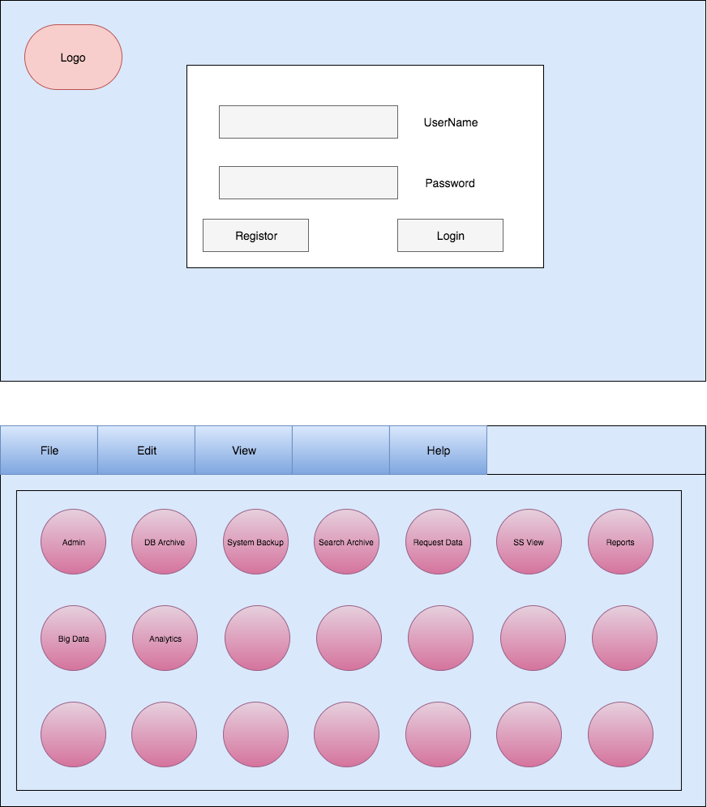

# AWS Arora Project

** Phase 1: **
The application has to be javascript based. It can only use client-side code no server-side.

```
root
  \scr
  \etc
  \instout
  \instin
  \index.html
```


1. Login page that will connect to an authentication provider:
    * Create a login screen that lets users log in or signup using Microsoft 360 authentication provided.
    * login should timeout. the timeout setting should be ably adjustable utilizing an admin setting page. Should have a placeholder for logs and text.
    * able to disable authentication during testing/development

2. Landing page with icons on it that I can add using a form.
    * The landing page should hold a container that can have blobs or iPhone/Android-like icons.
    * When you select the icons, the icons should take you to the next page.

3. A form that can write json to the root/ folder on the web page
  * Create a form that can be filled with
    1. text
    2. radio buttons
    3. drop-down list
    4. multiline text area.
    5. submit button.

  * When save button is pressed data from the form is saved to a folder in the root "instout".

